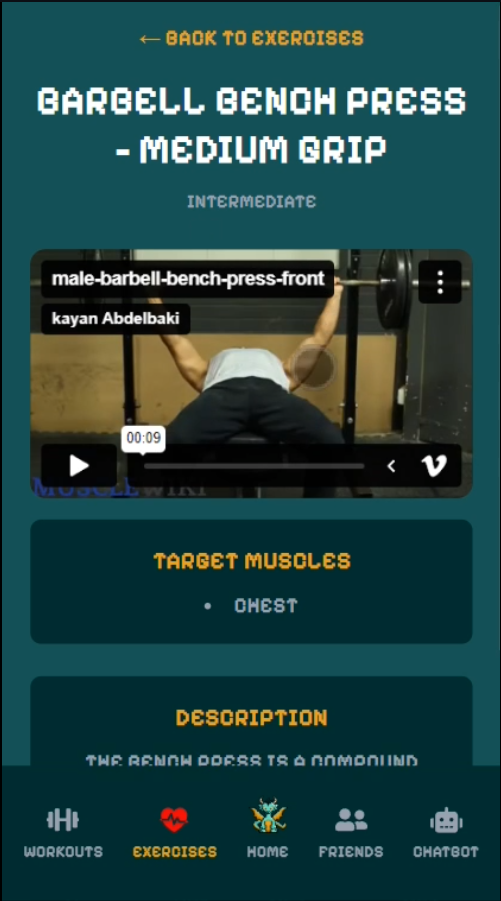

# DracoFit

Welcome to **DracoFit**, your all-in-one fitness app designed to help you track your workouts, manage your fitness goals, and monitor your progress using an animated dragon! DracoFit provides an intuitive and powerful platform for anyone looking to elevate their health and fitness journey.

---

## 🚀 Features

- **Animated Progress:** Track your progress by a dragon pet companion that evovles with you.
- **Workout Tracking:** Log workouts with sets, reps, and weights for various exercises.
- **Customizable Routines:** Create, edit, and manage personalized workout routines.
- **Goal Setting:** Set and monitor your fitness goals.
- **Responsive Design:** Fully responsive and mobile-friendly interface.

---

## 🖼️ Preview

Below are preview images showcasing DracoFit’s features:

<div align="center">
  
  
  
  
  
  
</div>

---

## 🛠️ Tech Stack

- **Frontend:** Plain React, TailwindCSS
- **Backend:** Node.js, Nest.js, PostGreSQL
- **Authentication:** JWT


---

## ⚡ Getting Started

### Prerequisites

- Node.js (v16+)
- npm or yarn

### Installation

1. **Clone the Repository:**
   ```bash
   git clone https://github.com/kayan2004/dracofit.git
   cd dracofit
   ```

2. **Install Dependencies:**
   ```bash
   npm install
   # or
   yarn install
   ```

3. **Set up Environment Variables:**
   - Create a `.env` file in the root directory.
   - Add your required environment variables

4. **Run the App:**
   ```bash
   npm run dev
   # or
   yarn dev
   ```

5. **Open in Browser:**
   ```
   http://localhost:3000
   ```

---


## 📄 License

This project is licensed under the MIT License.

---

## 📬 Contact

For questions or feedback, you can reach out via:

- GitHub Issues: [kayan2004/dracofit/issues](https://github.com/kayan2004/dracofit/issues)
- Email: kayanabdepbaki@gmail.com

---

Happy lifting with DracoFit!
